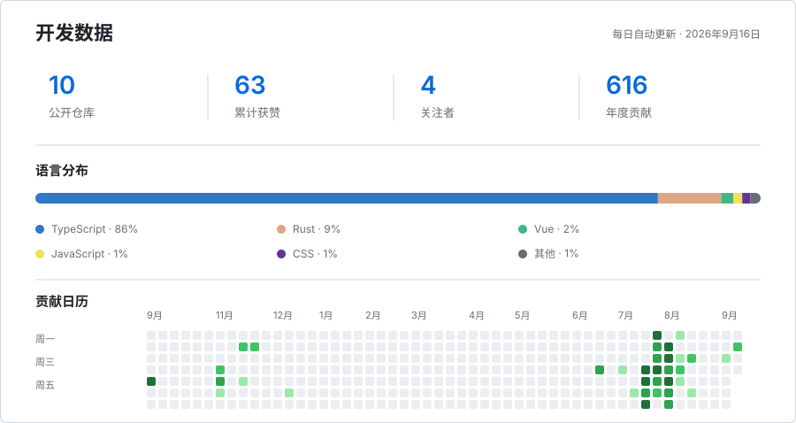

## 关于我

我是 Max，一名全栈工程师与 AI 应用开发者。

我关注从产品体验到系统交付的完整研发过程，致力于用清晰的架构和务实的技术方案，将复杂需求转化为可靠、易维护的软件。

- 打磨响应迅速、体验细腻的 Web 应用
- 设计易于维护和扩展的后端服务
- 推动大语言模型、智能体与智能工作流的工程化落地
- 通过容器化、自动化与可观测性保障稳定交付

欢迎交流软件工程、AI 应用与产品研发。

## 技术栈

**前端开发**

  
  
  
  
  

**后端与 AI**

  
  
  
  
  

**数据存储与运行环境**

  
  
  
  

## 开发数据

<picture>
  <source media="(max-width: 600px) and (prefers-color-scheme: dark)" srcset="./assets/github-metrics-mobile-dark.svg">
  <source media="(max-width: 600px) and (prefers-color-scheme: light)" srcset="./assets/github-metrics-mobile-light.svg">
  <source media="(prefers-color-scheme: dark)" srcset="./assets/github-metrics-dark.svg">
  <source media="(prefers-color-scheme: light)" srcset="./assets/github-metrics-light.svg">
  
</picture>
